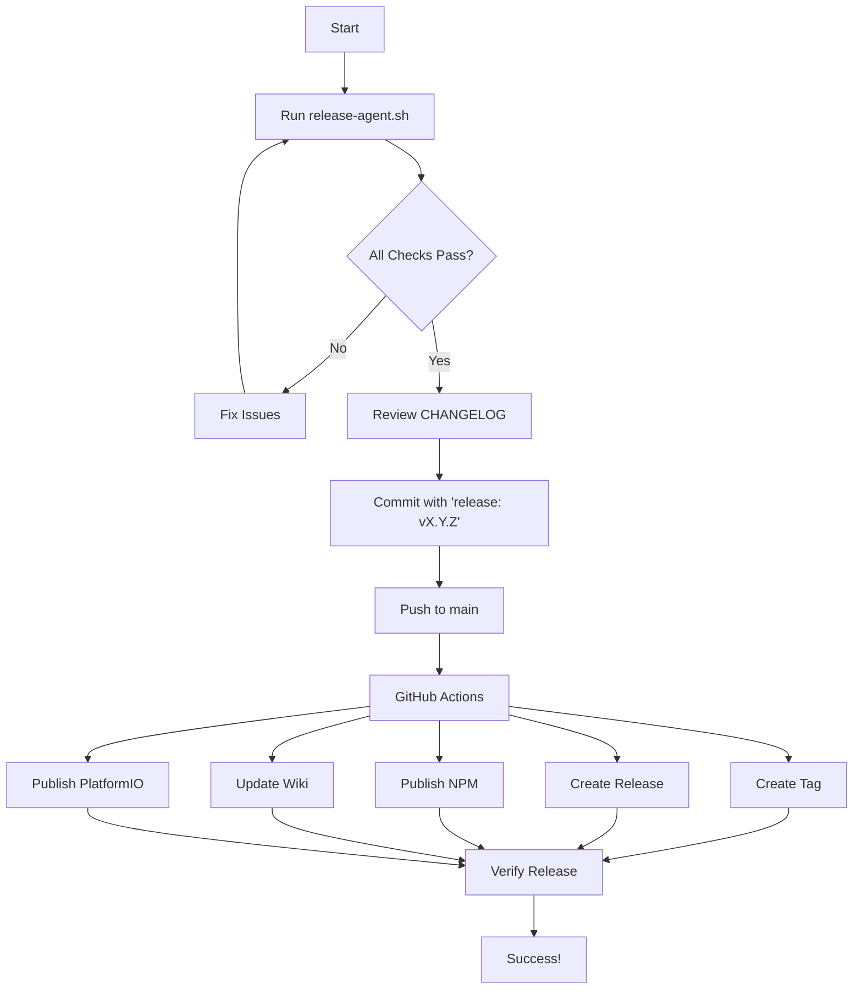

# Release Agents for AlteriomPainlessMesh

This directory contains agent specifications that automate and standardize various aspects of the AlteriomPainlessMesh project lifecycle.

## What are Release Agents?

Release agents are automated systems that ensure consistency, quality, and completeness in project releases. They implement comprehensive validation checks, automate repetitive tasks, and provide clear guidance throughout the release process.

## Available Agents

### Release Agent v1.0

**Location**: `release-agent.md`  
**Script**: `../../scripts/release-agent.sh`  
**Purpose**: Comprehensive release management and validation

The Release Agent ensures every release meets quality standards by:

- ✅ Validating version consistency across all package files
- ✅ Checking CHANGELOG completeness and format
- ✅ Verifying build system configuration
- ✅ Validating dependencies
- ✅ Checking git status and tags
- ✅ Ensuring release workflows are properly configured
- ✅ Validating documentation and links
- ✅ Running test suites (when available)

**Quick Start:**

```bash
# Run the release agent to check if ready for release
./scripts/release-agent.sh

# If all checks pass, follow the guided next steps
```

**Features:**

- **Pre-Release Validation**: Comprehensive checks before allowing release
- **Automated Checks**: 21+ validation points ensure nothing is missed
- **Clear Guidance**: Step-by-step instructions for fixing issues
- **Visual Feedback**: Color-coded output for easy scanning
- **CI/CD Integration**: Works in both local and CI environments
- **Error Recovery**: Specific solutions for common problems

## Usage

### For Developers

Run the release agent before creating a release:

```bash
# Check if ready for release
./scripts/release-agent.sh

# View help
./scripts/release-agent.sh --help

# View version
./scripts/release-agent.sh --version
```

### For CI/CD

The release agent is automatically integrated into GitHub Actions:

- **Validate Release Workflow**: Runs on every push to main/develop
- **Release Workflow**: Executes comprehensive validation before release

### Understanding Output

The release agent provides clear, color-coded output:

- 🟢 **Green (✓)**: Check passed
- 🔴 **Red (✗)**: Check failed - must fix before release
- 🟡 **Yellow (⚠)**: Warning - should review but won't block release
- 🔵 **Blue (ℹ)**: Informational message

**Example Output:**

```
╔════════════════════════════════════════════════════════════╗
║         AlteriomPainlessMesh Release Agent v1.0            ║
║           Automated Release Quality Assurance              ║
╚════════════════════════════════════════════════════════════╝

▶ Version Consistency Check
────────────────────────────────────────────────────────────
  ℹ library.properties: 1.7.9
  ℹ library.json: 1.7.9
  ℹ package.json: 1.7.9
  ✓ All version files are consistent: 1.7.9

...

╔════════════════════════════════════════════════════════════╗
║                    RELEASE READINESS                       ║
╠════════════════════════════════════════════════════════════╣
║ Version:        1.7.9
║ Checks Passed:  21
║ Checks Failed:  0
║ Warnings:       1
╠════════════════════════════════════════════════════════════╣
║ ✓ READY FOR RELEASE
╚════════════════════════════════════════════════════════════╝
```

## Integration with Existing Tools

The release agent complements existing release tools:

### Scripts

- `scripts/bump-version.sh` - Updates version numbers
- `scripts/validate-release.sh` - Basic validation (used by release agent)
- `scripts/release-agent.sh` - **NEW** - Comprehensive release validation

### Workflows

- `.github/workflows/release.yml` - Automated release pipeline
- `.github/workflows/validate-release.yml` - Pre-release validation
- `.github/workflows/manual-publish.yml` - Manual package publishing

### Documentation

- `RELEASE_GUIDE.md` - Detailed release process documentation
- `CHANGELOG.md` - Version history and changes
- `.github/agents/release-agent.md` - **NEW** - Release agent specification

## Release Workflow



## Extending the Release Agent

To add new validation checks to the release agent:

1. Edit `release-agent.md` to document the new check
2. Add a new `check_*()` function in `release-agent.sh`
3. Call the function from `main()` execution flow
4. Update the agent version in documentation
5. Test the new check thoroughly

Example:

```bash
# In scripts/release-agent.sh

check_new_requirement() {
    print_section "New Requirement Check"
    
    # Your validation logic here
    if [[ condition ]]; then
        check_pass "New requirement met"
        return 0
    else
        check_fail "New requirement not met"
        return 1
    fi
}

# Add to main():
check_new_requirement || true
```

## Best Practices

1. **Run Before Every Release**: Always run `./scripts/release-agent.sh` before creating a release commit
2. **Fix All Failures**: Don't proceed with red (✗) checks - they indicate blocking issues
3. **Review Warnings**: Yellow (⚠) warnings should be reviewed and addressed when possible
4. **Keep Documentation Updated**: Update `release-agent.md` when processes change
5. **Version the Agent**: Update agent version when making significant changes
6. **Test Locally First**: Run the release agent locally before pushing to CI

## Troubleshooting

### Common Issues

**"Version mismatch detected"**
```bash
# Solution: Use bump script to synchronize versions
./scripts/bump-version.sh patch 1.7.9
```

**"Tag already exists"**
```bash
# Solution: Either delete the tag or bump version
git push origin :refs/tags/v1.7.9  # Delete remote tag
git tag -d v1.7.9                   # Delete local tag
# Or bump to next version
./scripts/bump-version.sh patch
```

**"No CHANGELOG entry found"**
```bash
# Solution: Add entry to CHANGELOG.md
# Format: ## [1.7.9] - 2025-11-08
```

**"Working tree has uncommitted changes"**
```bash
# This is just a warning - review and commit if needed
git status
git add .
git commit -m "Prepare for release"
```

### Getting Help

- **Documentation**: See `release-agent.md` for complete specification
- **Release Guide**: See `../../RELEASE_GUIDE.md` for process details
- **Issues**: Report bugs at https://github.com/Alteriom/painlessMesh/issues
- **Script Help**: Run `./scripts/release-agent.sh --help`

## Version History

### v1.0 (2025-11-08)

Initial release of the Release Agent system:

- Comprehensive pre-release validation (21+ checks)
- Clear visual feedback and guidance
- CI/CD integration
- Error recovery documentation
- Automated release workflow validation
- Documentation link checking
- Dependency validation
- Test suite integration

## Contributing

To improve the release agent:

1. Fork the repository
2. Create a feature branch
3. Make your changes to `release-agent.md` and/or `release-agent.sh`
4. Test thoroughly with various scenarios
5. Submit a pull request with clear description

## License

The release agent is part of AlteriomPainlessMesh and follows the same LGPL-3.0 license.

---

**Questions or Suggestions?**

Open an issue at https://github.com/Alteriom/painlessMesh/issues with the `release` label.
