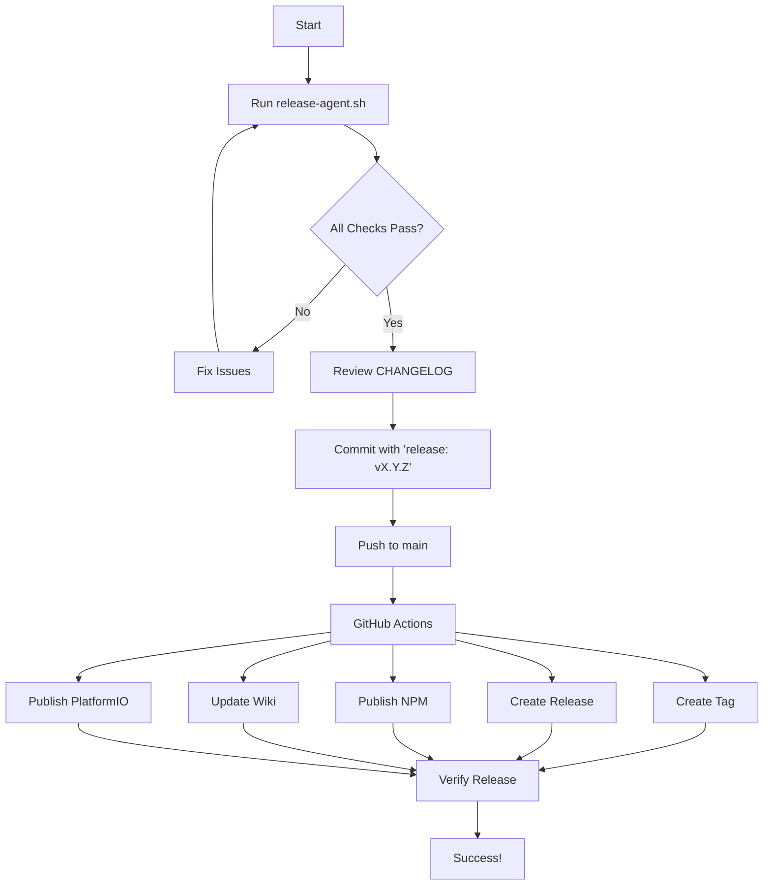

# Alteriom AI Agents for painlessMesh

This directory contains the AI agent specifications for the AlteriomPainlessMesh project, implementing a two-tier architecture for maximum effectiveness.

## Two-Tier Agent Architecture

### Tier 1: Organization-Level Agent

**Alteriom AI Agent** (`@alteriom-ai-agent`) - The "Holy Grail"
- **Scope:** All Alteriom repositories
- **Tools:** Full access to all tools via MCP (Model Context Protocol)
- **Capabilities:** Unlimited - can perform any task in any repository
- **Purpose:** Universal problem solver with complete tool access

**When to use:**
- Cross-repository tasks
- Complex multi-step implementations
- Tasks requiring full tool access
- Anything requiring execution capability

### Tier 2: Repository-Level Coordinators

**painlessMesh Coordinator** (`@painlessmesh-coordinator`)
- **Scope:** This repository only
- **Tools:** Read and search (specialized context, not execution)
- **Capabilities:** Deep repository knowledge, task decomposition
- **Purpose:** Ensure complete task execution, catch missing components

**When to use:**
- Need complete checklist for a feature
- Verify all related tasks are identified
- Ensure repository conventions are followed
- Coordinate with Alteriom AI Agent for execution

### How They Work Together

```
User: "Add GPS support to painlessMesh"
  ↓
@painlessmesh-coordinator: Analyzes request, creates complete checklist
  - GpsPackage class (type 203)
  - Test cases
  - Example sketch
  - Documentation
  - Type registry update
  ↓
@alteriom-ai-agent: Executes with full tool access
  - Creates all files
  - Runs tests
  - Builds examples
  - Commits changes
  ↓
@painlessmesh-coordinator: Verifies completeness
  ✓ All components implemented
  ✓ Tests pass
  ✓ Documentation complete
```

## Available Agents

### Tier 1: Organization-Level

#### Alteriom AI Agent (`@alteriom-ai-agent`)
**Location**: `alteriom-ai-agent.md`  
**Scope**: All Alteriom repositories  
**Tools**: Full MCP access (filesystem, bash, git, GitHub, PostgreSQL, Docker, Python)

The universal Alteriom agent with unlimited capabilities:
- ✅ Works in any Alteriom repository
- ✅ Has access to all tools via MCP servers
- ✅ Can execute any command or modification
- ✅ Coordinates cross-repository tasks
- ✅ Delegates to repo coordinators for deep context

**When to use:** Any task requiring execution, file modification, or tool usage

### Tier 2: Repository Coordinators

#### painlessMesh Coordinator (`@painlessmesh-coordinator`)
**Location**: `painlessmesh-coordinator.md`  
**Scope**: This repository only  
**Tools**: Read, search (context specialist, not executor)

The repository expert who ensures complete task execution:
- ✅ Deep knowledge of painlessMesh structure
- ✅ Identifies all related tasks for any change
- ✅ Creates comprehensive checklists
- ✅ Ensures nothing is forgotten (tests, docs, examples)
- ✅ Verifies repository conventions are followed
- ✅ Coordinates with Alteriom AI Agent for execution

**When to use:** Planning features, verifying completeness, understanding what's needed

### Specialized Agents

#### Release Agent (`@release-agent`)
**Location**: `release-agent.md`  
**Script**: `../../scripts/release-agent.sh`  
**Purpose**: Release management and validation

**⚠️ IMPORTANT: Requires Alteriom AI Agent (`@alteriom-ai-agent`) with full tool access for file editing and execution.**

Ensures every release meets quality standards:
- ✅ Validates version consistency across all 7 package files
- ✅ Checks CHANGELOG completeness and format
- ✅ Verifies build system configuration
- ✅ Validates dependencies
- ✅ Checks git status and tags
- ✅ Ensures release workflows are properly configured
- ✅ Validates documentation and links
- ✅ Runs test suites
- ✅ Edits files: Updates versions, dates, and CHANGELOG structure
- ✅ Executes commands: Runs validation scripts, commits, and pushes

**Files updated for each release:**
1. library.properties
2. library.json
3. package.json
4. src/painlessMesh.h
5. src/AlteriomPainlessMesh.h
6. README.md
7. CHANGELOG.md

**When to use:** 
- Preparing releases with `@alteriom-ai-agent`
- Validating release readiness with validation script
- **DO NOT** use with repository coordinator (lacks file editing tools)

#### Mesh Development Agent (`@mesh-dev-agent`)
**Location**: `mesh-dev-agent.md`  
**Purpose**: ESP32/ESP8266 mesh networking development

Expert in embedded mesh development:
- ✅ ESP8266/ESP32 platform knowledge
- ✅ Memory optimization for constrained devices
- ✅ Alteriom package development
- ✅ Mesh networking patterns
- ✅ Platform-specific debugging

**When to use:** Developing mesh features, optimizing memory, creating Alteriom packages

#### Documentation Agent (`@docs-agent`)
**Location**: `docs-agent.md`  
**Purpose**: Documentation maintenance and creation

Specialized in technical documentation:
- ✅ Creates comprehensive README files
- ✅ Writes tested code examples
- ✅ Maintains API documentation
- ✅ Ensures documentation accuracy
- ✅ Manages Docusaurus/Docsify sites

**When to use:** Creating or updating documentation, writing examples

#### Testing Agent (`@testing-agent`)
**Location**: `testing-agent.md`  
**Purpose**: Catch2 unit testing

Expert in C++ unit testing:
- ✅ Generates Catch2 test cases
- ✅ Debugs test failures
- ✅ Ensures test coverage
- ✅ Validates package serialization
- ✅ Maintains test infrastructure

**When to use:** Creating tests, debugging test failures, ensuring coverage

#### Other Specialized Agents
- **test-specialist** - Alternative testing specialist
- **release-validator** - Release validation focused
- **docs-writer** - Documentation writer
- **mesh-developer** - Alternative mesh developer

## Quick Start Guide

### For Simple Tasks
```bash
# Just use Alteriom AI Agent directly
@alteriom-ai-agent Fix the typo in README.md
```

### For Complete Features
```bash
# 1. Ask coordinator what's needed
@painlessmesh-coordinator What's needed to add GPS support?

# Coordinator responds with checklist...

# 2. Execute with Alteriom AI Agent
@alteriom-ai-agent Implement GPS feature per coordinator checklist

# 3. Verify completeness
@painlessmesh-coordinator Verify GPS implementation is complete
```

### For Releases
```bash
# Run release agent validation
./scripts/release-agent.sh

# Or ask via agent
@release-agent Am I ready to release?
```

### For Specialized Tasks
```bash
# Use domain-specific agents
@mesh-dev-agent Optimize memory usage for ESP8266
@docs-agent Document the new GPS package
@testing-agent Create tests for GPS serialization
```

## Usage Patterns

### Pattern 1: Direct Execution (Simple)
**Best for:** Typo fixes, small changes, simple tasks

```
User → @alteriom-ai-agent → Done
```

Example:
```
@alteriom-ai-agent Update version to 1.9.3
```

### Pattern 2: Coordinated Feature (Recommended)
**Best for:** New features, complex changes, anything with multiple components

```
User → @painlessmesh-coordinator → Checklist
     → @alteriom-ai-agent → Execute checklist
     → @painlessmesh-coordinator → Verify
```

Example:
```
User: @painlessmesh-coordinator What's needed for GPS?
Coordinator: [Provides complete checklist]
User: @alteriom-ai-agent Implement per checklist
Agent: [Implements all items]
User: @painlessmesh-coordinator Verify GPS complete
Coordinator: ✓ All items implemented
```

### Pattern 3: Specialized Consultation
**Best for:** Domain-specific optimization, specialized knowledge

```
User → @specialized-agent → Recommendations
     → @alteriom-ai-agent → Execute
```

Example:
```
User: @mesh-dev-agent How to optimize memory for ESP8266?
Mesh Dev: [Provides strategies]
User: @alteriom-ai-agent Apply these optimizations
```

**Quick Start:**

```bash
# Run the release agent to check if ready for release
./scripts/release-agent.sh

# If all checks pass, follow the guided next steps
```

**Features:**

- **Pre-Release Validation**: Comprehensive checks before allowing release
- **Automated Checks**: 21+ validation points ensure nothing is missed
- **Clear Guidance**: Step-by-step instructions for fixing issues
- **Visual Feedback**: Color-coded output for easy scanning
- **CI/CD Integration**: Works in both local and CI environments
- **Error Recovery**: Specific solutions for common problems

## Usage

### For Developers

Run the release agent before creating a release:

```bash
# Check if ready for release
./scripts/release-agent.sh

# View help
./scripts/release-agent.sh --help

# View version
./scripts/release-agent.sh --version
```

### For CI/CD

The release agent is automatically integrated into GitHub Actions:

- **Validate Release Workflow**: Runs on every push to main/develop
- **Release Workflow**: Executes comprehensive validation before release

### Understanding Output

The release agent provides clear, color-coded output:

- 🟢 **Green (✓)**: Check passed
- 🔴 **Red (✗)**: Check failed - must fix before release
- 🟡 **Yellow (⚠)**: Warning - should review but won't block release
- 🔵 **Blue (ℹ)**: Informational message

**Example Output:**

```
╔════════════════════════════════════════════════════════════╗
║         AlteriomPainlessMesh Release Agent v1.0            ║
║           Automated Release Quality Assurance              ║
╚════════════════════════════════════════════════════════════╝

▶ Version Consistency Check
────────────────────────────────────────────────────────────
  ℹ library.properties: 1.7.9
  ℹ library.json: 1.7.9
  ℹ package.json: 1.7.9
  ✓ All version files are consistent: 1.7.9

...

╔════════════════════════════════════════════════════════════╗
║                    RELEASE READINESS                       ║
╠════════════════════════════════════════════════════════════╣
║ Version:        1.7.9
║ Checks Passed:  21
║ Checks Failed:  0
║ Warnings:       1
╠════════════════════════════════════════════════════════════╣
║ ✓ READY FOR RELEASE
╚════════════════════════════════════════════════════════════╝
```

## Integration with Existing Tools

The release agent complements existing release tools:

### Scripts

- `scripts/bump-version.sh` - Updates version numbers
- `scripts/validate-release.sh` - Basic validation (used by release agent)
- `scripts/release-agent.sh` - **NEW** - Comprehensive release validation

### Workflows

- `.github/workflows/release.yml` - Automated release pipeline
- `.github/workflows/validate-release.yml` - Pre-release validation
- `.github/workflows/manual-publish.yml` - Manual package publishing

### Documentation

- `RELEASE_GUIDE.md` - Detailed release process documentation
- `CHANGELOG.md` - Version history and changes
- `.github/agents/release-agent.md` - **NEW** - Release agent specification

## Release Workflow



## Extending the Release Agent

To add new validation checks to the release agent:

1. Edit `release-agent.md` to document the new check
2. Add a new `check_*()` function in `release-agent.sh`
3. Call the function from `main()` execution flow
4. Update the agent version in documentation
5. Test the new check thoroughly

Example:

```bash
# In scripts/release-agent.sh

check_new_requirement() {
    print_section "New Requirement Check"
    
    # Your validation logic here
    if [[ condition ]]; then
        check_pass "New requirement met"
        return 0
    else
        check_fail "New requirement not met"
        return 1
    fi
}

# Add to main():
check_new_requirement || true
```

## Best Practices

1. **Run Before Every Release**: Always run `./scripts/release-agent.sh` before creating a release commit
2. **Fix All Failures**: Don't proceed with red (✗) checks - they indicate blocking issues
3. **Review Warnings**: Yellow (⚠) warnings should be reviewed and addressed when possible
4. **Keep Documentation Updated**: Update `release-agent.md` when processes change
5. **Version the Agent**: Update agent version when making significant changes
6. **Test Locally First**: Run the release agent locally before pushing to CI

## Troubleshooting

### Common Issues

**"Version mismatch detected"**
```bash
# Solution: Use bump script to synchronize versions
./scripts/bump-version.sh patch 1.7.9
```

**"Tag already exists"**
```bash
# Solution: Either delete the tag or bump version
git push origin :refs/tags/v1.7.9  # Delete remote tag
git tag -d v1.7.9                   # Delete local tag
# Or bump to next version
./scripts/bump-version.sh patch
```

**"No CHANGELOG entry found"**
```bash
# Solution: Add entry to CHANGELOG.md
# Format: ## [1.7.9] - 2025-11-08
```

**"Working tree has uncommitted changes"**
```bash
# This is just a warning - review and commit if needed
git status
git add .
git commit -m "Prepare for release"
```

### Getting Help

- **Documentation**: See `release-agent.md` for complete specification
- **Release Guide**: See `../../RELEASE_GUIDE.md` for process details
- **Issues**: Report bugs at https://github.com/Alteriom/painlessMesh/issues
- **Script Help**: Run `./scripts/release-agent.sh --help`

## Version History

### v1.0 (2025-11-08)

Initial release of the Release Agent system:

- Comprehensive pre-release validation (21+ checks)
- Clear visual feedback and guidance
- CI/CD integration
- Error recovery documentation
- Automated release workflow validation
- Documentation link checking
- Dependency validation
- Test suite integration

## Contributing

To improve the release agent:

1. Fork the repository
2. Create a feature branch
3. Make your changes to `release-agent.md` and/or `release-agent.sh`
4. Test thoroughly with various scenarios
5. Submit a pull request with clear description

## License

The release agent is part of AlteriomPainlessMesh and follows the same LGPL-3.0 license.

---

**Questions or Suggestions?**

Open an issue at https://github.com/Alteriom/painlessMesh/issues with the `release` label.
