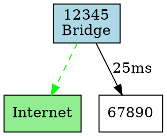

# Enhanced Diagnostics API for Bridge Operations

## Overview

The Enhanced Diagnostics API provides comprehensive tools for monitoring, debugging, and analyzing painlessMesh bridge operations. This API gives developers programmatic access to bridge state, election history, network topology, and connectivity testing.

## Features

✅ Bridge status monitoring  
✅ Election history tracking  
✅ Network topology visualization  
✅ Connectivity testing  
✅ Comprehensive diagnostic reports  
✅ Minimal overhead when enabled  

## Table of Contents

- [Getting Started](#getting-started)
- [Bridge State API](#bridge-state-api)
- [Network Topology API](#network-topology-api)
- [Diagnostics API](#diagnostics-api)
- [Data Structures](#data-structures)
- [Examples](#examples)
- [Best Practices](#best-practices)

## Getting Started

### Enable Diagnostics

Diagnostics must be explicitly enabled to track election history and bridge changes:

```cpp
void setup() {
  mesh.init(MESH_SSID, MESH_PASSWORD, &scheduler, MESH_PORT);
  
  // Enable diagnostics tracking
  mesh.enableDiagnostics(true);
}
```

**Note:** Diagnostics have minimal overhead and only track data when enabled.

## Bridge State API

### getBridgeStatus()

Get current bridge status and role information for this node.

```cpp
BridgeStatus status = mesh.getBridgeStatus();

Serial.printf("Role: %s\n", status.role.c_str());
Serial.printf("Is Bridge: %s\n", status.isBridge ? "Yes" : "No");
Serial.printf("Internet: %s\n", status.internetConnected ? "Yes" : "No");

if (status.bridgeNodeId != 0) {
  Serial.printf("Bridge Node: %u (RSSI: %d dBm)\n", 
                status.bridgeNodeId, status.bridgeRSSI);
}
```

**Returns:** `BridgeStatus` structure containing:
- `isBridge` - Is this node acting as a bridge?
- `internetConnected` - Is Internet available?
- `role` - Node role: "regular", "bridge", or "root"
- `bridgeNodeId` - Current bridge node ID (0 if none)
- `bridgeRSSI` - Signal strength to bridge/router (dBm)
- `timeSinceBridgeChange` - Time since last bridge change (ms)

### getElectionHistory()

Get list of recent bridge elections (requires diagnostics enabled).

```cpp
auto history = mesh.getElectionHistory();

for (const auto& election : history) {
  Serial.printf("Election: Winner=%u, RSSI=%d dBm, Candidates=%u\n",
                election.winnerNodeId, election.winnerRSSI, 
                election.candidateCount);
  Serial.printf("  Reason: %s\n", election.reason.c_str());
}
```

**Returns:** `std::vector<ElectionRecord>` (limited to last 10 elections)

**Note:** Returns empty vector if diagnostics are not enabled.

### getLastBridgeChange()

Get information about the most recent bridge change event.

```cpp
auto event = mesh.getLastBridgeChange();

if (event.timestamp > 0) {
  Serial.printf("Bridge changed from %u to %u\n",
                event.oldBridgeId, event.newBridgeId);
  Serial.printf("Reason: %s\n", event.reason.c_str());
  Serial.printf("Internet available: %s\n", 
                event.internetAvailable ? "Yes" : "No");
}
```

**Returns:** `BridgeChangeEvent` structure

## Network Topology API

### getInternetPath(nodeId)

Find the routing path from a specific node to the Internet bridge.

```cpp
auto path = mesh.getInternetPath(targetNodeId);

if (path.size() > 0) {
  Serial.print("Path to Internet: ");
  for (auto nodeId : path) {
    Serial.printf("%u -> ", nodeId);
  }
  Serial.println("Internet");
} else {
  Serial.println("No path to Internet available");
}
```

**Parameters:**
- `nodeId` - Node to find path from

**Returns:** `std::vector<uint32_t>` containing node IDs in the path (empty if no path)

### getBridgeForNodeId(nodeId)

Get the bridge node ID that a specific node should use to reach the Internet.

```cpp
uint32_t bridgeId = mesh.getBridgeForNodeId(targetNodeId);

if (bridgeId != 0) {
  Serial.printf("Node %u uses bridge %u\n", targetNodeId, bridgeId);
} else {
  Serial.println("No bridge available");
}
```

**Parameters:**
- `nodeId` - Node to find bridge for

**Returns:** Bridge node ID, or 0 if no bridge available

### exportTopologyDOT()

Export mesh topology in GraphViz DOT format for visualization.

```cpp
String dot = mesh.exportTopologyDOT();
Serial.println(dot);

// Save to file or send to visualization tool
// Visualize at: http://www.webgraphviz.com/
```

**Returns:** String containing DOT format graph

**Example Output:**


## Diagnostics API

### enableDiagnostics(enabled)

Enable or disable diagnostics collection.

```cpp
// Enable diagnostics
mesh.enableDiagnostics(true);

// Disable diagnostics
mesh.enableDiagnostics(false);
```

**Parameters:**
- `enabled` - true to enable, false to disable

**Note:** Must be enabled before calling `getElectionHistory()` or to track bridge changes.

### testBridgeConnectivity()

Test connectivity to the primary bridge and measure latency.

```cpp
auto result = mesh.testBridgeConnectivity();

if (result.success) {
  Serial.printf("✓ Bridge test PASSED: %s\n", result.message.c_str());
  Serial.printf("  Latency: %u ms\n", result.latencyMs);
  Serial.printf("  Internet reachable: %s\n", 
                result.internetReachable ? "Yes" : "No");
} else {
  Serial.printf("✗ Bridge test FAILED: %s\n", result.message.c_str());
}
```

**Returns:** `BridgeTestResult` structure containing:
- `success` - Overall test success
- `bridgeReachable` - Can reach bridge node
- `internetReachable` - Can reach Internet through bridge
- `latencyMs` - Round-trip latency to bridge
- `message` - Detailed test message

### isBridgeReachable(bridgeNodeId)

Check if a specific bridge node is reachable from this node.

```cpp
if (mesh.isBridgeReachable(bridgeNodeId)) {
  Serial.println("Bridge is reachable");
} else {
  Serial.println("Bridge is NOT reachable");
}
```

**Parameters:**
- `bridgeNodeId` - Bridge node ID to test

**Returns:** true if reachable, false otherwise

### getDiagnosticReport()

Generate a comprehensive, human-readable diagnostic report.

```cpp
Serial.println(mesh.getDiagnosticReport());
```

**Example Output:**
```
=== painlessMesh Diagnostics ===
Node ID: 12345
Mode: regular
Mesh Nodes: 5
Bridge: 99999 (RSSI: -45 dBm, Internet: ✓)
Direct Connections: 2
Messages RX: 1234
Messages TX: 987
Messages Dropped: 5
Avg Latency: 25 ms
Uptime: 02:15:33
Last Election: 00:45:12 ago (Winner: 99999, 3 candidates)
================================
```

**Returns:** String containing formatted diagnostic report

## Data Structures

### BridgeStatus

```cpp
struct BridgeStatus {
  bool isBridge;                // Is this node acting as a bridge?
  bool internetConnected;       // Is Internet available?
  TSTRING role;                 // "regular", "bridge", or "root"
  uint32_t bridgeNodeId;        // Current bridge node ID (0 if none)
  int8_t bridgeRSSI;           // Signal strength to bridge (dBm)
  uint32_t timeSinceBridgeChange; // Time since last bridge change (ms)
};
```

### ElectionRecord

```cpp
struct ElectionRecord {
  uint32_t timestamp;           // When election occurred (millis)
  uint32_t winnerNodeId;       // Node that won election
  int8_t winnerRSSI;          // Winner's router RSSI
  uint32_t candidateCount;    // Number of candidates
  TSTRING reason;              // Why election was triggered
};
```

### BridgeChangeEvent

```cpp
struct BridgeChangeEvent {
  uint32_t timestamp;           // When change occurred (millis)
  uint32_t oldBridgeId;        // Previous bridge node ID
  uint32_t newBridgeId;        // New bridge node ID
  TSTRING reason;               // Reason for change
  bool internetAvailable;       // Internet available after change
};
```

### BridgeTestResult

```cpp
struct BridgeTestResult {
  bool success;                 // Overall test success
  bool bridgeReachable;         // Can reach bridge node
  bool internetReachable;       // Can reach Internet
  uint32_t latencyMs;          // Round-trip latency (ms)
  TSTRING message;              // Detailed test message
};
```

## Examples

### Basic Diagnostics Monitoring

```cpp
void setup() {
  mesh.init(MESH_SSID, MESH_PASSWORD, &scheduler, MESH_PORT);
  mesh.enableDiagnostics(true);
  
  // Print diagnostics every 30 seconds
  userScheduler.addTask(Task(30000, TASK_FOREVER, []() {
    Serial.println(mesh.getDiagnosticReport());
  }));
}
```

### Bridge Status Monitoring with Callback

```cpp
void setup() {
  mesh.onBridgeStatusChanged([](uint32_t bridgeId, bool hasInternet) {
    if (hasInternet) {
      Serial.println("Internet available - sending queued data");
      sendQueuedMessages();
    } else {
      Serial.println("Internet offline - queueing messages");
    }
  });
}
```

### Periodic Bridge Connectivity Testing

```cpp
Task testTask(60000, TASK_FOREVER, []() {
  auto result = mesh.testBridgeConnectivity();
  
  if (!result.success) {
    Serial.printf("Bridge issue: %s\n", result.message.c_str());
    // Trigger failover or alert
  } else if (result.latencyMs > 100) {
    Serial.println("Warning: High latency to bridge");
  }
});
```

### Topology Visualization Export

```cpp
// Export topology every 5 minutes for external visualization
Task exportTask(300000, TASK_FOREVER, []() {
  String dot = mesh.exportTopologyDOT();
  
  // Send to monitoring server or save to SD card
  sendToMonitoringServer(dot);
  
  // Or save locally
  File file = SD.open("/topology.dot", FILE_WRITE);
  file.print(dot);
  file.close();
});
```

## Best Practices

### 1. Enable Diagnostics Selectively

Only enable diagnostics when needed for debugging or monitoring:

```cpp
#ifdef DEBUG
  mesh.enableDiagnostics(true);
#endif
```

### 2. Monitor Bridge Changes

Always set up a bridge status callback to react to connectivity changes:

```cpp
mesh.onBridgeStatusChanged([](uint32_t bridgeId, bool hasInternet) {
  // Handle bridge state changes
  if (!hasInternet) {
    startOfflineMode();
  } else {
    resumeOnlineMode();
  }
});
```

### 3. Test Connectivity Before Critical Operations

Before sending important data, test bridge connectivity:

```cpp
void sendCriticalData(String data) {
  auto result = mesh.testBridgeConnectivity();
  
  if (result.success && result.internetReachable) {
    mesh.sendSingle(bridgeId, data);
  } else {
    queueForLater(data);
  }
}
```

### 4. Use Diagnostic Reports for Troubleshooting

When users report issues, ask them to copy the diagnostic report:

```cpp
// Add a command to print diagnostics on demand
if (Serial.available()) {
  char cmd = Serial.read();
  if (cmd == 'd') {
    Serial.println(mesh.getDiagnosticReport());
  }
}
```

### 5. Export Topology for Visualization

Regularly export topology to understand mesh structure:

```cpp
// Export topology to help visualize network issues
void exportTopology() {
  String dot = mesh.exportTopologyDOT();
  
  // Save or transmit for later analysis
  // Visualize at http://www.webgraphviz.com/
}
```

## Performance Considerations

- **Memory:** Election history limited to 10 records (approximately 200 bytes)
- **CPU:** Minimal overhead when diagnostics enabled (<1% CPU)
- **Network:** No additional network traffic (uses existing bridge status messages)

## Integration with Monitoring Systems

### MQTT Example

```cpp
void publishDiagnostics() {
  String report = mesh.getDiagnosticReport();
  mqttClient.publish("mesh/diagnostics", report.c_str());
  
  auto status = mesh.getBridgeStatus();
  String json = String("{\"role\":\"") + status.role + 
                "\",\"internet\":" + (status.internetConnected ? "true" : "false") + 
                ",\"bridge\":" + status.bridgeNodeId + "}";
  mqttClient.publish("mesh/status", json.c_str());
}
```

### HTTP REST API Example

```cpp
void handleDiagnosticsRequest() {
  server.send(200, "text/plain", mesh.getDiagnosticReport());
}

void handleTopologyRequest() {
  server.send(200, "text/plain", mesh.exportTopologyDOT());
}
```

## Troubleshooting

### Q: getElectionHistory() returns empty vector

**A:** Ensure diagnostics are enabled with `mesh.enableDiagnostics(true)` before elections occur.

### Q: testBridgeConnectivity() always fails

**A:** Check that:
1. A bridge node exists in the mesh
2. The bridge is broadcasting status (enabled by default)
3. Your node can route to the bridge

### Q: getDiagnosticReport() shows "Bridge: None available"

**A:** This means no healthy bridge with Internet connection was found. Check:
1. Bridge node is running and configured correctly
2. Bridge has Internet connectivity
3. Bridge status broadcasts are enabled

## API Reference Summary

| Method | Description | Returns |
|--------|-------------|---------|
| `enableDiagnostics(bool)` | Enable/disable diagnostics tracking | void |
| `getBridgeStatus()` | Get current bridge status | BridgeStatus |
| `getElectionHistory()` | Get recent elections | vector<ElectionRecord> |
| `getLastBridgeChange()` | Get last bridge change | BridgeChangeEvent |
| `getInternetPath(nodeId)` | Get path to Internet | vector<uint32_t> |
| `getBridgeForNodeId(nodeId)` | Get bridge for node | uint32_t |
| `exportTopologyDOT()` | Export topology | String |
| `testBridgeConnectivity()` | Test bridge connection | BridgeTestResult |
| `isBridgeReachable(id)` | Check bridge reachability | bool |
| `getDiagnosticReport()` | Get comprehensive report | String |

## See Also

- [Bridge Architecture](BRIDGE_ARCHITECTURE_IMPLEMENTATION.md)
- [Bridge Health Monitoring](BRIDGE_HEALTH_MONITORING_IMPLEMENTATION.md)
- [Example Sketch](examples/diagnosticsExample/diagnosticsExample.ino)
- [API Documentation](docs/)

## Version History

- **v1.8.1** - Initial release of Enhanced Diagnostics API

## License

This feature is part of painlessMesh and follows the same license terms.
